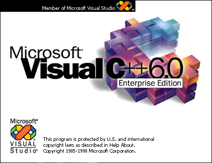

# Visual C++ 6.0 over Docker

Have you ever needed to build some C++ code for an old version of Windows using Visual C++ 6.0 from 1998? No? Well anyways here's a working toolchain on a Docker container for it.



## Using it

```bash
# Starts a Windows CMD
docker run --rm -it -v $(pwd):/prj giulioz/vc6-docker

# Inside the CMD...
cd z:\prj

# Now you can use the compiler!
cd example
cl test.cpp /IZ:\opt\vc\include /GX /link /LIBPATH:Z:\opt\vc\LIB
test # Hello world!
```

You can also use a Makefile:

```bash
# While in the example folder...
nmake
test # Hello world!
```

### Getting the includes

When working with your editor of choice (like VS Code) you may need to configure the include path for the suggestions. Since the files are inside the container, you can use the following command to copy them in your machine.

```bash
docker run --rm -it -v $(pwd):/prj giulioz/vc6-docker bash /opt/vc/copy_includes.sh
```

## Building it

```bash
docker build . --tag giulioz/vc6-docker
docker push giulioz/vc6-docker
```

If you are (like me) on a M1 Mac:

```bash
docker buildx build --platform linux/amd64 . -t giulioz/vc6-docker
docker push giulioz/vc6-docker
```
